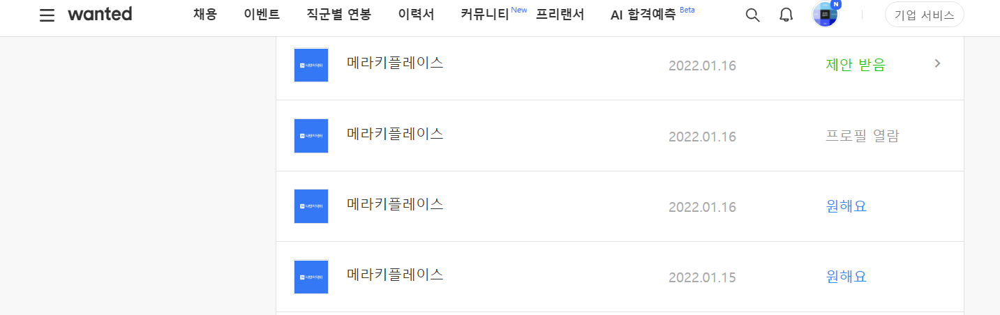
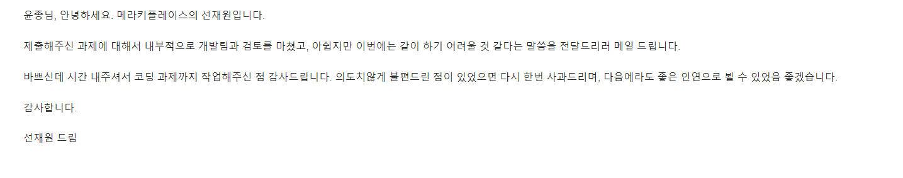

# 메라 키플레이스

원티드를 통해서 계속 귀찮게 제안을 보내길래 제안을 받고 과제 테스트를 진행했다.  
먼저 제안을 먼저 보내놓고 과제 테스트를 제안(심지어 해당 채용 공고상 과제 테스트가 없었음) 하는 것도 이상했고,  
과제 내용도 이상했다. 보통 과제 테스트를 하면서 실제 사용되는 API 2개를 연동해서 실제 쓰이는 기능 개발을 요청 한것도  
이해가 안갔는데 개발한 내용을 깃허브 같은 공개된 영역이 아닌 알집 압축으로 개인 메일로 보내달라는 제안하는 부분도 이상했고,
과제라고 보낸 PDF에서 명시해둔 API 키가 전부 틀린 점도 이해하기 힘들었다.  
  
채용 과제라는 명목으로 자기들 소스 개발을 외주 주는게 아닌가 의심이 들어서 3일 정도 시간 간격으로 요구 사항을 최소한으로  
구현해서 금요일 오후쯤에 구글 드라이브로 알집 파일을 올려서 공유해줬다. 
그후 일요일 오후2시쯤(금요일 오후 부터 토요일, 일요일 동안 개발자들끼리 출근해서 과제를 검토했다는 소리인가?)  
에 과제 테스트 결과 전형탈락이라는 메일을 보내왔다. (정상적인 회사가 아니라는걸 볼 수 있다.)  
  
처음부터 느낌이 안좋았으나 단순히 감과 몇가지 잘못으로 상대방에 대해서 속단하는건 그닥 바람직 하지 않다고 생각하여서  
전형에 응했으며 이제 결과가 나왔으니 공익을 목적으로 관련 내용들을 공개해둔다.
